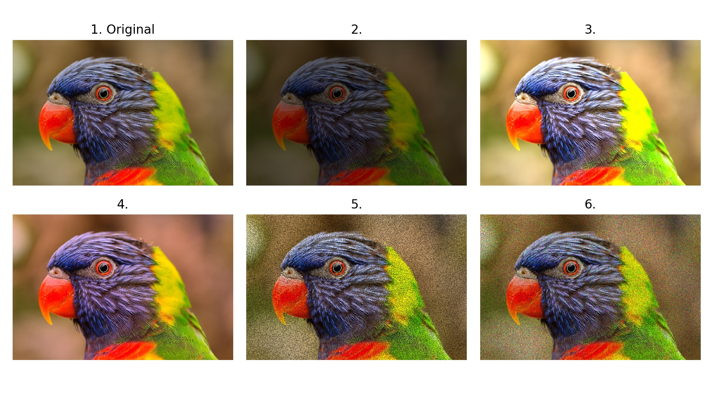
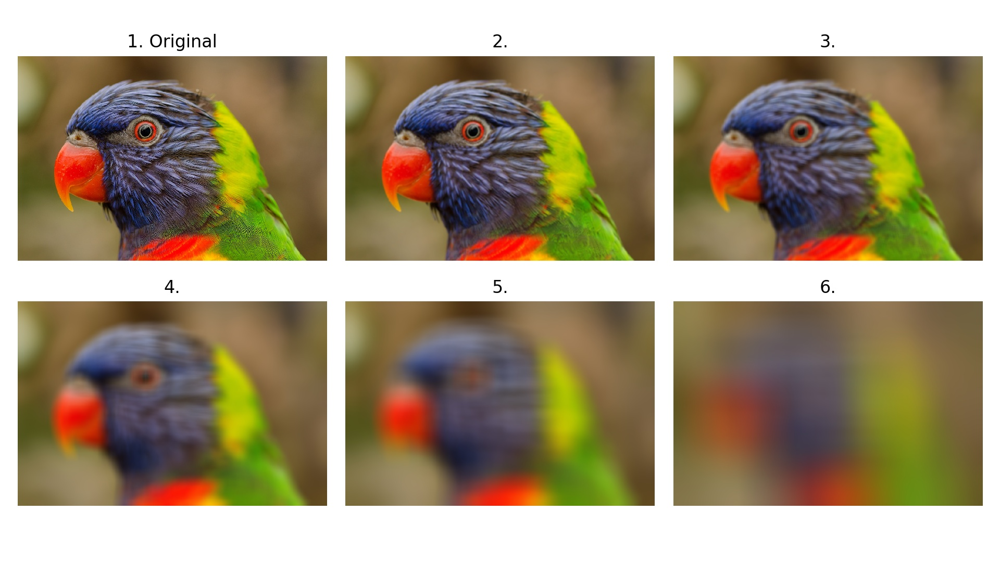

# Notebooks

If you found errors in the notebooks, please create:

1. Pull request with the fix
or
2. Submit an issue to the [main repository of Albumentations](https://github.com/albumentations-team/albumentations/issues)

- [](https://colab.research.google.com/github/albumentations-team/albumentations_examples/blob/main/notebooks/example.ipynb) [example.ipynb](notebooks/example.ipynb). Defining a simple augmentation pipeline for image augmentation.
- [](https://colab.research.google.com/github/albumentations-team/albumentations_examples/blob/main/notebooks/example_16_bit_tiff.ipynb) [example_16_bit_tiff.ipynb](notebooks/example_16_bit_tiff.ipynb). Working with non-8-bit images.
- [](https://colab.research.google.com/github/albumentations-team/albumentations_examples/blob/main/notebooks/example_bboxes.ipynb) [example_bboxes.ipynb](notebooks/example_bboxes.ipynb). Using Albumentations to augment bounding boxes for object detection tasks.
- [](https://colab.research.google.com/github/albumentations-team/albumentations_examples/blob/main/notebooks/example_bboxes2.ipynb) [example_bboxes2.ipynb](notebooks/example_bboxes2.ipynb). How to use Albumentations for detection tasks if you need to keep all bounding boxes.
- [](https://colab.research.google.com/github/albumentations-team/albumentations_examples/blob/main/notebooks/example_kaggle_salt.ipynb) [example_kaggle_salt.ipynb](notebooks/example_kaggle_salt.ipynb). Using Albumentations for a semantic segmentation task.
- [](https://colab.research.google.com/github/albumentations-team/albumentations_examples/blob/main/notebooks/example_keypoints.ipynb) [example_keypoints.ipynb](notebooks/example_keypoints.ipynb). Using Albumentations to augment keypoints.
- [](https://colab.research.google.com/github/albumentations-team/albumentations_examples/blob/main/notebooks/example_multi_target.ipynb) [example_multi_target.ipynb](notebooks/example_multi_target.ipynb). Applying the same augmentation with the same parameters to multiple images, masks, bounding boxes, or keypoints.
- [](https://colab.research.google.com/github/albumentations-team/albumentations_examples/blob/main/notebooks/example_weather_transforms.ipynb) [example_weather_transforms.ipynb](notebooks/example_weather_transforms.ipynb). Weather augmentations in Albumentations.
- [](https://colab.research.google.com/github/albumentations-team/albumentations_examples/blob/main/notebooks/migrating_from_torchvision_to_albumentations.ipynb) [migrating_from_torchvision_to_albumentations.ipynb](notebooks/migrating_from_torchvision_to_albumentations.ipynb). Migrating from torchvision to Albumentations.
- [](https://colab.research.google.com/github/albumentations-team/albumentations_examples/blob/main/notebooks/replay.ipynb) [replay.ipynb](notebooks/replay.ipynb). Debugging an augmentation pipeline with ReplayCompose.
- [](https://colab.research.google.com/github/albumentations-team/albumentations_examples/blob/main/notebooks/serialization.ipynb) [serialization.ipynb](notebooks/serialization.ipynb). How to save and load parameters of an augmentation pipeline.
- [](https://colab.research.google.com/github/albumentations-team/albumentations_examples/blob/main/notebooks/showcase.ipynb) [showcase.ipynb](notebooks/showcase.ipynb). Showcase. Cool augmentation examples on diverse set of images from various real-world tasks.
- [](https://colab.research.google.com/github/albumentations-team/albumentations_examples/blob/main/notebooks/tensorflow-example.ipynb) [tensorflow-example.ipynb](notebooks/tensorflow-example.ipynb). Using Albumentations with Tensorflow.
- [](https://colab.research.google.com/github/albumentations-team/albumentations_examples/blob/main/notebooks/pytorch_classification.ipynb) [pytorch_classification.ipynb](notebooks/pytorch_classification.ipynb). PyTorch and Albumentations for image classification.
- [](https://colab.research.google.com/github/albumentations-team/albumentations_examples/blob/main/notebooks/pytorch_semantic_segmentation.ipynb) [pytorch_semantic_segmentation.ipynb](notebooks/pytorch_semantic_segmentation.ipynb). PyTorch and Albumentations for semantic segmentation.
- [](https://colab.research.google.com/github/albumentations-team/albumentations_examples/blob/main/notebooks/example_xymasking.ipynb) [xy_transform.ipynb](notebooks/example_xymasking.ipynb). How to apply [XYMasking](https://albumentations.ai/docs/api_reference/augmentations/dropout/xy_masking/#xymasking-augmentation-augmentationsdropoutxy_masking).
- [](https://colab.research.google.com/github/albumentations-team/albumentations_examples/blob/main/notebooks/example_mixup.ipynb) [mixup.ipynb](notebooks/example_mixup.ipynb). How to apply [MixUp](https://albumentations.ai/docs/api_reference/augmentations/mixing).
- [](https://colab.research.google.com/github/albumentations-team/albumentations_examples/blob/main/notebooks/example_chromatic_aberration.ipynb) [example_chromatic_aberration.ipynb](notebooks/example_chromatic_aberration.ipynb). How to apply [ChromaticAberration](https://albumentations.ai/docs/api_reference/full_reference/?h=chroma#albumentations.augmentations.transforms.ChromaticAberration).
- [](https://colab.research.google.com/github/albumentations-team/albumentations_examples/blob/main/notebooks/example_d4.ipynb) [example_d4.ipynb](notebooks/example_d4.ipynb). How to apply [D4](https://albumentations.ai/docs/api_reference/full_reference/?h=d4#albumentations.augmentations.geometric.transforms.D4) transform.
- [](https://colab.research.google.com/github/albumentations-team/albumentations_examples/blob/main/notebooks/example_gridshuffle.ipynb) [example_gridshuffle.ipynb](notebooks/example_gridshuffle.ipynb). How to apply [RandomGridShuffle](https://albumentations.ai/docs/api_reference/full_reference/?h=randomgrid#albumentations.augmentations.transforms.RandomGridShuffle) transform.
- [](https://colab.research.google.com/github/albumentations-team/albumentations_examples/blob/main/notebooks/example_documents.ipynb) [example_documents.ipynb](notebooks/example_documents.ipynb). How to apply Morphological, both erosion and dilation.
- [](https://colab.research.google.com/github/albumentations-team/albumentations_examples/blob/main/notebooks/example_hfhub.ipynb) [example_hfhub.ipynb](notebooks/example_hfhub.ipynb). How to load and save augmentation pipeline to HuggungFace Hub.
- [](https://colab.research.google.com/github/albumentations-team/albumentations_examples/blob/main/notebooks/example_OverlayElements.ipynb) [example_documents.ipynb](notebooks/example_OverlayElements.ipynb). How to apply OverlayElements to update text on the image
- [](https://colab.research.google.com/github/albumentations-team/albumentations_examples/blob/main/notebooks/example_textimage.ipynb) [example_textimage.ipynb](notebooks/example_textimage.ipynb). How to add text to the image

## Usage examples

For detailed examples, see [notebooks](https://github.com/albumentations-team/albumentations_examples/tree/main/notebooks).

```python
from albumentations import (
    Affine, CLAHE,Blur, OpticalDistortion, GridDistortion, HueSaturationValue,
    GaussNoise, MotionBlur, MedianBlur,
    RandomBrightnessContrast, D4, OneOf, Compose
)
import numpy as np

def strong_aug(p=0.5):
    return Compose([
        D4(),
        GaussNoise(),
        OneOf([
            MotionBlur(p=0.2),
            MedianBlur(blur_limit=3, p=0.1),
            Blur(blur_limit=3, p=0.1),
        ], p=0.2),
        Affine(translate_percent=0.0625, scale=(0.8, 1.2), rotate=(-45, 45), p=0.2),
        OneOf([
            OpticalDistortion(p=0.3),
            GridDistortion(p=0.1)
        ], p=0.2),
        OneOf([
            CLAHE(clip_limit=2),
            RandomBrightnessContrast(),
        ], p=0.3),
        HueSaturationValue(p=0.3),
    ], p=p)

image = np.ones((300, 300, 3), dtype=np.uint8)
mask = np.ones((300, 300), dtype=np.uint8)
whatever_data = "my name"
augmentation = strong_aug(p=0.9)
data = {"image": image, "mask": mask, "whatever_data": whatever_data, "additional": "hello"}
augmented = augmentation(**data)
image, mask, whatever_data, additional = augmented["image"], augmented["mask"], augmented["whatever_data"], augmented["additional"]
```

## Augmentations examples

[MultiplicativeNoise]([MultiplicativeNoise](https://albumentations.ai/docs/api_reference/full_reference/?h=multiplicativenoise#albumentations.augmentations.transforms.MultiplicativeNoise))
-------------------

1. Original image
2. `MultiplicativeNoise(multiplier=0.5, p=1)`
3. `MultiplicativeNoise(multiplier=1.5, p=1)`
4. `MultiplicativeNoise(multiplier=[0.5, 1.5], per_channel=True, p=1)`
5. `MultiplicativeNoise(multiplier=[0.5, 1.5], elementwise=True, p=1)`
6. `MultiplicativeNoise(multiplier=[0.5, 1.5], elementwise=True, per_channel=True, p=1)`



[ToSepia]([ToSepia](https://albumentations.ai/docs/api_reference/full_reference/?h=tosepia#albumentations.augmentations.transforms.ToSepia))
-------

1. Original image
2. `ToSepia(p=1)`


[ChannelDropout]([ChannelDropout](https://albumentations.ai/docs/api_reference/augmentations/dropout/channel_dropout/?h=channeld#channeldropout-augmentation-augmentationsdropoutchannel_dropout))
--------------

1. Original image
2. `ChannelDropout(channel_drop_range=(1, 1), fill_value=0, p=1)`
3. `ChannelDropout(channel_drop_range=(1, 1), fill_value=0, p=1)`
4. `ChannelDropout(channel_drop_range=(1, 1), fill_value=0, p=1)`
5. `ChannelDropout(channel_drop_range=(1, 1), fill_value=0, p=1)`
6. `ChannelDropout(channel_drop_range=(1, 1), fill_value=0, p=1)`
7. `ChannelDropout(channel_drop_range=(2, 2), fill_value=0, p=1)`
8. `ChannelDropout(channel_drop_range=(2, 2), fill_value=0, p=1)`
9. `ChannelDropout(channel_drop_range=(2, 2), fill_value=0, p=1)`


[ChannelShuffle]([ChannelShuffle](https://albumentations.ai/docs/api_reference/full_reference/?h=channelshu#albumentations.augmentations.transforms.ChannelShuffle))
--------------

1. Original image
2. `ChannelShuffle(p=1)`
3. `ChannelShuffle(p=1)`
4. `ChannelShuffle(p=1)`


[ToGray]([ToGray](https://albumentations.ai/docs/api_reference/full_reference/?h=togray#albumentations.augmentations.transforms.ToGray))
------

1. Original image
2. `ToGray(p=1)`


[InvertImg]([InvertImg](https://albumentations.readthedocs.io/en/latest/api/augmentations.html#albumentations.augmentations.transforms.InvertImg))
---------

1. Original image
2. `InvertImg(p=1)`


[VerticalFlip]([VerticalFlip](https://albumentations.ai/docs/api_reference/full_reference/?h=vertical#albumentations.augmentations.geometric.transforms.VerticalFlip))
------------

1. Original image
2. `VerticalFlip(p=1)`


[HorizontalFlip]([HorizontalFlip](https://albumentations.ai/docs/api_reference/full_reference/?h=vertical#albumentations.augmentations.geometric.transforms.HorizontalFlip))
--------------

1. Original image
2. `HorizontalFlip(p=1)`


[Flip]([Flip](https://albumentations.ai/docs/api_reference/full_reference/?h=flip#albumentations.augmentations.geometric.transforms.Flip))
----

1. Original image
2. `Flip(p=1)`
3. `Flip(p=1)`
4. `Flip(p=1)`


[RandomGridShuffle]([RandomGridShuffle](https://albumentations.ai/docs/api_reference/full_reference/?h=randomgridshuffle#albumentations.augmentations.transforms.RandomGridShuffle))
-----------------

1. Original image
2. `RandomGridShuffle(grid=(3, 3), p=1)`
3. `RandomGridShuffle(grid=(5, 5), p=1)`
4. `RandomGridShuffle(grid=(7, 7), p=1)`


[Blur]([Blur](https://albumentations.ai/docs/api_reference/augmentations/blur/transforms/?h=blur#albumentations.augmentations.blur.transforms.Blur))
----

1. Original image
2. `Blur(blur_limit=(7, 7), p=1)`
3. `Blur(blur_limit=(15, 15), p=1)`
4. `Blur(blur_limit=(50, 50), p=1)`
5. `Blur(blur_limit=(100, 100), p=1)`
6. `Blur(blur_limit=(300, 300), p=1)`


